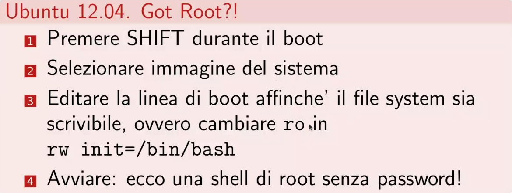
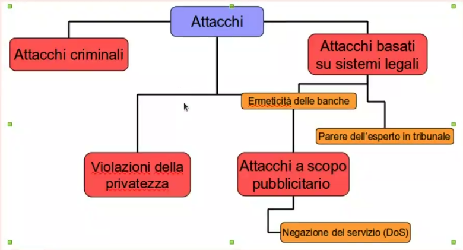
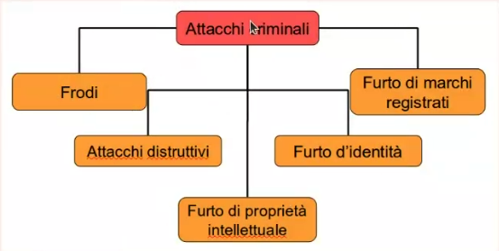
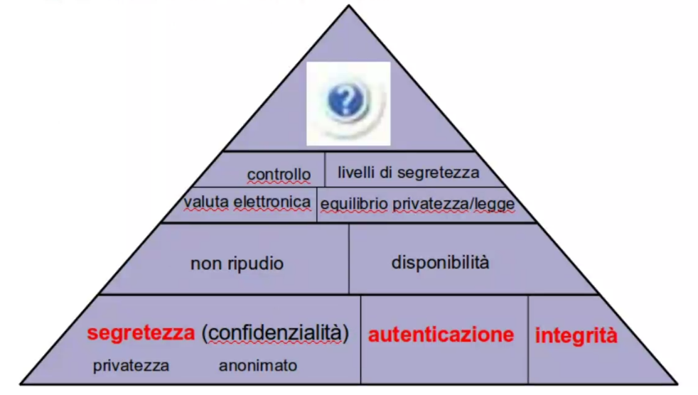
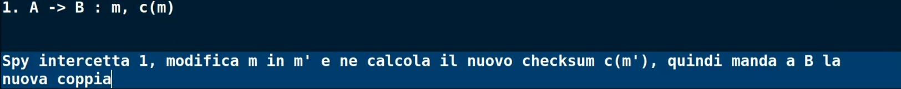
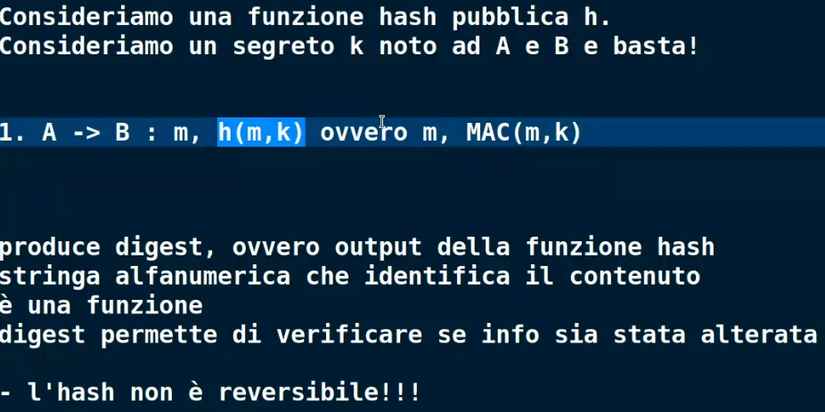

# Lezione 17/03/2026

## Attacchi

> Un trojan è un malware che introduce una vulnerabilità

> L'attacco è lo sfruttamento della vulnerabilità

### Come fa un individuo ad autenticarsi?
>Un individuo si identica con la sua
carta di identità o documento che sia, per i documenti personali l'associazione tra individuo e documento viene fatta tramite la fotografia.

L'accesso fisico ad un dispositivo, ha esso stesso una possibile strutturazione dal punto di vista offensivo.

Tutti i dispositivi hanno, by design, delle procedure d'accesso bypassando il controllo di accesso.

L'utilizzo di funzioni è uno degli obiettivi dell'accesso.

L'attività indebita è basata al centro sull'uso del sistema e sull'acquisizione di dati sensibili.

I problemi di sicurezza comprendono anche i problemi di sicurezza del dato, l'acquisizione di dati sensibili rientra nella protezione della privacy, però viene comunque considerato un problema di sicurezza.

La sicurezza può essere vista come la protezione di risorse, servizi e dati, in particolare la parte che riguarda i dati prende il nome di Data Protection, e rientra in ciò che chiamiamo Privacy, che è un diritto.

### Attacco reale: rooting di Linux post furto

### Attacco reale: pirateria digitale

La pirateria ha a che fare con la pirateria digitale, quindi audio, video, giochi, software, marchi.

- Furto di proprietà intellettuale: infinita copiabilità, usare watermaking come contromisura

- Furto di identità: può essere usata ad esempio una tecnica chiamata domain squatting, utilizzando un dominio quasi identico a quello originale ed effettuare attacchi di phishing

- Furto di marchio

### Attacco reale: sniffing

Il problema dello sniffing, in una rete locale, non sarà mai risolvibile in quanto possiamo sempre fare ARP Spoofing.
Pur non risolvendolo possiamo renderlo "meno utile" utilizzando protocolli che usano cifratura, per evitare che l'attaccante veda in chiaro i pacchetti.

> Se non riesco a trovare una misura per risolvere una vulnerabilità, cosa posso fare? (Possibile domanda d'esame)

### Classificazione di attacchi

## Proprietà di Sicurezza

**Importante**

Alla base abbiamo proprietà fondamentali della sicurezza, nella punta della piramide vediamo un punto interrogativo.
Se ci dovessero chiedere quante sono le proprietà di sicurezza la risposta è "non è possibile contarli" poichè in costante evoluzione.

## Segretezza

> L'informazione non sia rilasciata ad entità non autorizzate a conoscerla

Misure:
- Crittografia: protocollo crittografico (SSL, IPSec)
- Steganografia: protocollo steganografico 
(least-significant bit)

## Autenticazione

> Le entità siano esattamente chi dichiarano di essere

## Integrità

> L'informazione non sia modificata da entità non autorizzate

Per integro si intenda genuino, non alterato, non manipolato.

L'integrità è importante a tutti i livelli, ad esempio l'integrità di una transazione, 

Alcune misure:
- Checksum (?)
- MAC
- Firma elettronica

**Esempio problema checksum:**

*Il checksum non è pensato per resistere ad un attaccante attivo*

**Soluzione:**

In generale la risposta che noi stiamo cercando è il MAC.

> HMAC è un tipo di MAC, il MAC  (Message Authentication Code) è un valore calcolato su un messaggio usando una chiave segreta condivisa.
L'HMAC usa una funzione hash ed una chiave segreta.

MAC = funzione(messaggio, chiave segreta)

Questa misura ci da sia **integrità** che **autenticazione**.

> Il MAC è la primitiva crittografica per ottenere la proprietà di Integrità.

